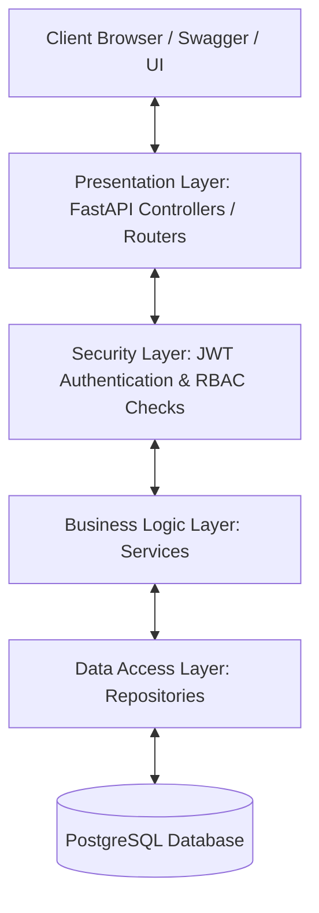
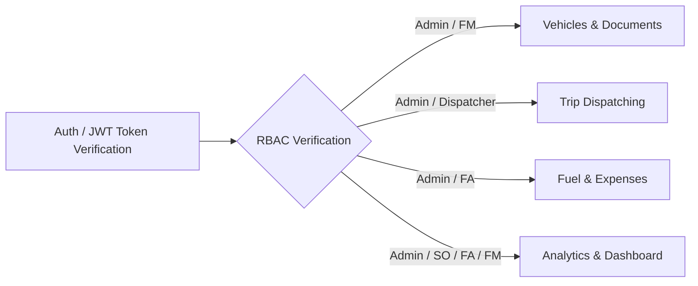
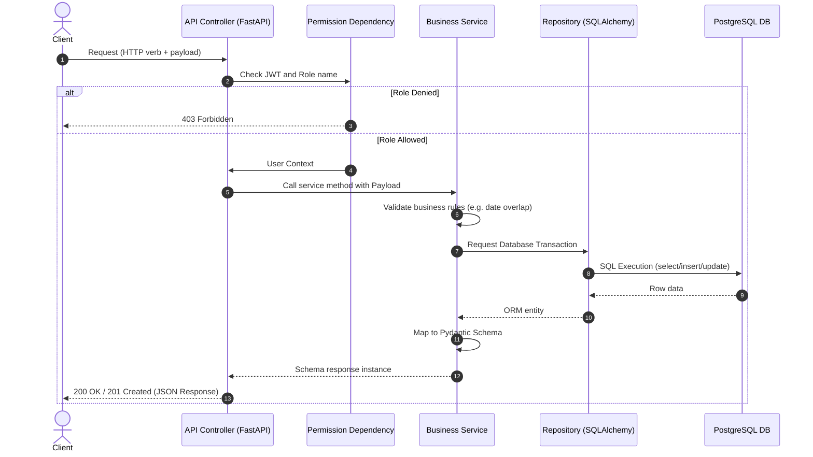
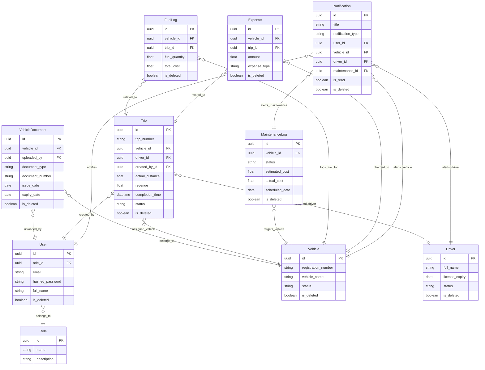
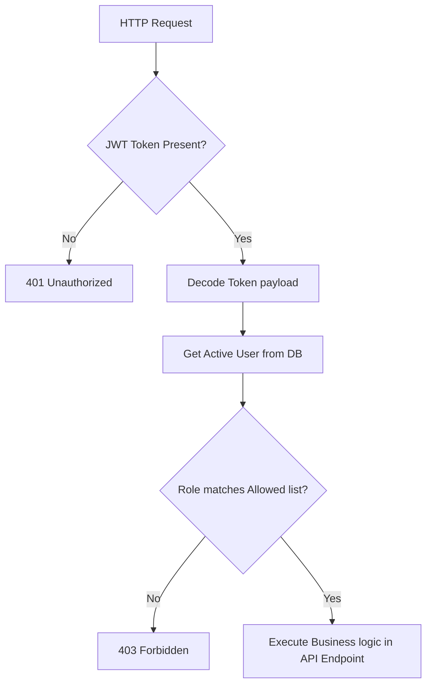
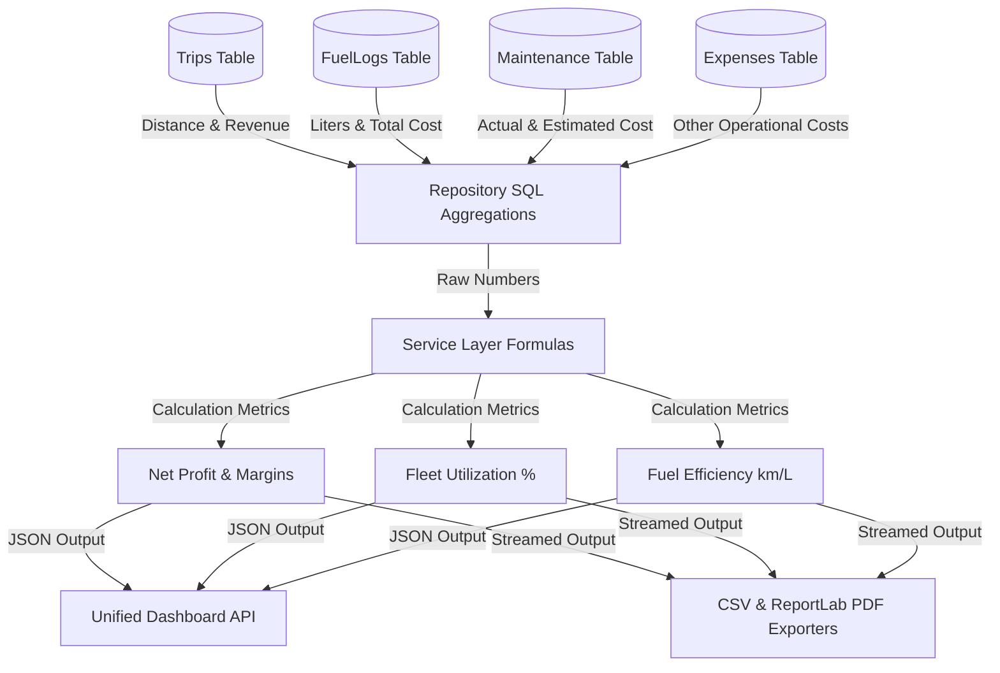
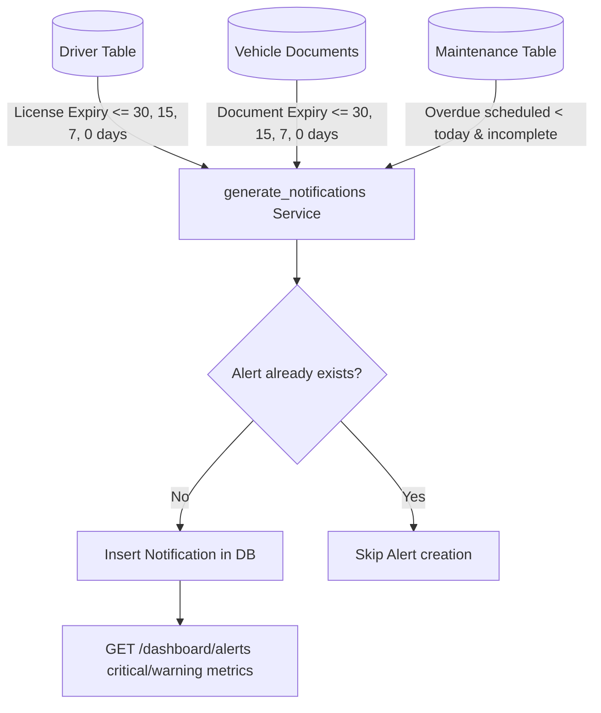
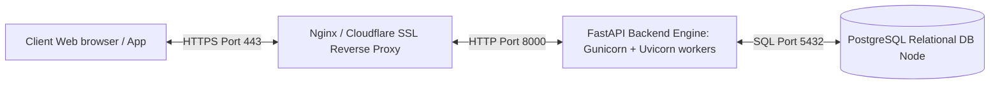

# Software Architecture Document – TransitOps

This document details the architectural patterns, request cycles, security policies, database structures, and engineering decisions implemented inside the TransitOps backend system.

---

## 🏛️ High-Level Architecture

TransitOps follows a clean, layered architectural pattern that separates presentation, business operations, data queries, and storage layers:

### Module Flow & Middleware
All requests from the presentation layer validate authorization credentials prior to reaching the domain business processes:

---

## 🔁 Request Cycle & Data Flow

Every standard CRUD or query request goes through a sequential lifecycle:

---

## 📁 Project Structure & Responsibilities

The codebase organizes files inside domain-specific directories to minimize tight coupling:

| Directory | Responsibility | Architectural Layer |
| :--- | :--- | :--- |
| **`app/Auth/`** | Token verification, login validations, and payload parsing. | Presentation / Security |
| **`app/Users/`** | Stores `User` model, CRUD handlers, and registration schemas. | Domain Module |
| **`app/Vehicles/`** | Handles `Vehicle` registration, updates, and `VehicleDocument` CRUD. | Domain Module |
| **`app/Drivers/`** | Details about drivers, licenses, categories, and safety indices. | Domain Module |
| **`app/Trips/`** | Contains state checks, dispatch rules, odometer logs, and arrival times. | Domain Module |
| **`app/Maintenance/`** | Manages maintenance logs, status changes, and downtime estimates. | Domain Module |
| **`app/FuelExpense/`** | Audits fuel consumption quantities, costs, and parking/repair fees. | Domain Module |
| **`app/Notifications/`**| Scans for expiring licenses/documents and creates reminder logs. | Domain Module |
| **`app/Analytics/`** | Computes KPI ratios, reports, monthly charts, and CSV/PDF exporters. | Application Services |
| **`app/Security/`** | Password hashing functions and RBAC dependency decorators. | Cross-Cutting Security |
| **`app/Database/`** | Context engine setup, transaction session generators, and migrations base. | Database Layer |
| **`app/Utils/`** | Application settings, constants, and custom config mappings. | Utilities |

---

## 🗄️ Database Schema & Relationships (ERD)

The relational schema ensures data integrity and supports complex reporting aggregations:

---

## 🔒 Security Architecture (RBAC Flow)

TransitOps enforces role-based access validation using reusable FastAPI dependencies:

---

## 📊 Analytics Aggregation Architecture

The Analytics Module aggregates data directly from multiple entities to compute KPI summaries:

---

## 🔔 Notifications & Alerts Workflow

Notifications are created by a centralized scan function that checks for expiry limits:

---

## 🧱 Design & Architecture Principles

- **Repository Pattern**: All database querying is isolated inside class repositories (e.g. `VehicleRepository`). Services never construct direct SQL statements, keeping the data layer decoupled.
- **Service Layer**: Business rule validations, calculations, and error checks reside inside domain service classes (e.g. `TripService`), ensuring clean controllers.
- **Soft Delete Pattern**: Entities inherit `is_deleted` attributes. Data is marked `is_deleted = True` instead of being physically purged, protecting database referential integrity.
- **Transaction Safety**: All create, modify, and delete transactions run inside standard rollback guards. Database operations execute `db.flush()` and only `commit()` at the final execution step.
- **Error Handlers**:
  - `400 Bad Request`: Validation issues (e.g. dispatching a completed trip).
  - `403 Forbidden`: RBAC role permission blockings.
  - `404 Not Found`: Missing resource identifiers.
  - `422 Unprocessable Entity`: Request body parser mismatches.
  - `500 Internal Server Error`: Unexpected runtime anomalies.
- **Performance Optimizations**:
  - **Pagination**: Limits dataset fetches using SQL page slicing.
  - **Indexes**: Applied to foreign keys and lookup queries (e.g. `vehicle_id`, `driver_id`, `is_read`).
  - **Aggregations**: Summarizes financial math and fuel efficiency ratios directly in Postgres using SQL `func.sum` and `func.count` queries.

---

## 🌐 Deployment Architecture

TransitOps can be deployed inside containerized network layers:

